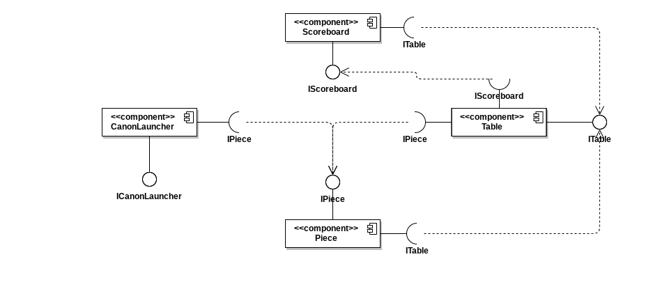
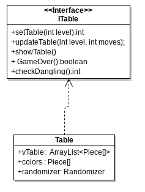
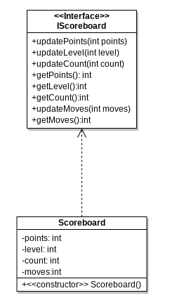
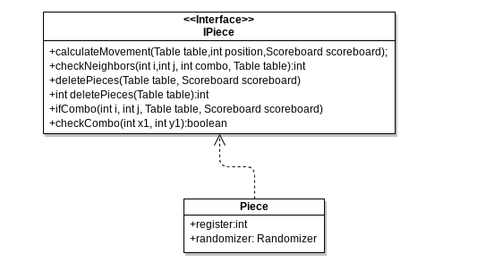
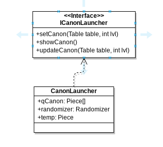

# Modelo para Apresentação do Projeto

# Projeto `Bubbles`

# Descrição Resumida do Projeto/Jogo

* Criação de um jogo de niveis utilizando conceitos de programação orientado a objetos e 'cellular automata' para um trabalho de Unicamp.
 
* O jogo consistirá de um canhão controlado pelo jogador que lança peças de diferentes tipos. O jogo terá um tabuleiro pre-determinado com peças, e ao juntar pelo menos 3 peças do mesmo tipo, as mesmas desaparecem. O objetivo entao é eliminar todas as peças do tabuleiro para passar de fase e arrecatar pontos. Diferentes combinações pode ter efeitos indesejáveis. Ao realizar jogadas, uma barra do topo começa a encurtar o tabuleiro e se não houver mais espaço para o canhão lançar peças, perde-se o jogo.

# Equipe
* `Melanie N Soares` - `241997`

# Vídeos do Projeto

## Vídeo do Jogo
> [

## Relatório de Evolução

> O principal dificuldade do projeto foi ter que programar em um chromebook de espaco muito limitado (muito ruim nao recomendo). Ao desenvolver esse projeto, muito das implementacoes que inicialmente estive em mente foram aperfeicoados ou mudados ao aprender coisas novas no decorrer da disciplina. Algumas mudancas sao:

* Armazenamento da quantidade de pecas em um vetor colors[5]. Tal necessidade surge do fato que o componente canon poderia ter pecas de um tipo nao presente no tabuleiro. Sendo assim, era muito dificil eliminar todas as pecas do tabuleiro ja que sempre sera lancado pecas randomizando no tabuleiro. Agora isso nao acontece e o canon sempre retorna pecas presentes.

* Ao aprender sobre arrays dinamicos, o tabuleiro representado por vTable deixa de ser estatico e passa a ser dinamico. Isso eh importante porque esse vTable vai diminuindo ao longo do jogo e portanto nao eh mais necessario clonar as pecas presentes em vTable para um novo vetor.
~~~java
Antigamente
  public void updateTable(int level, int moves){
    if(level <= 5 && moves == 6 || level > 5 && moves == 5){
      //update vTable
  
      int length = vTable.length;
      vTable = resizeTable(length);
        
      if(GameOver()){
          //game over;
      }
      
    }
  }

  public Piece[][] resizeTable(int length){
       Piece table[][] = new Piece[length-1][7];
       for(int i = 0; i < length - 1;i++){
           for(int j = 0; j < 7; j++){
               table[i][j] = vTable[i][j];
           }
       }
       return table;
   }
~~~
Passa a ser simples
~~~java
  public void updateTable(int level, int moves){
    if(level <= 5 && moves % 6 == 0){
      int length = vTable.size() - 1;
      vTable.remove(length);
  
    }
  }
~~~

   

# Destaques de Código
~~~java
Recursão para verificar os vizinhos da peça lançada e adiciona pecas de tipos iguais a um array dinamico
 public int checkNeighbors(int i,int j, int combo, Table table)
    {
        if(i-1>=0 && table.vTable.get(i-1)[j] != null && table.vTable.get(i-1)[j].register == register && checkCombo(i-1,j)){
            vCombo.add(new Positions(i-1,j));
            combo = checkNeighbors(i-1,j,combo+1,table);
        }
        if(j-1 >= 0 && table.vTable.get(i)[j-1] != null && table.vTable.get(i)[j-1].register == register && checkCombo(i,j-1)){
            vCombo.add(new Positions(i,j-1));
            combo=checkNeighbors(i,j-1,combo+1,table);
        }
        if(j+1<=8 && table.vTable.get(i)[j+1] != null && table.vTable.get(i)[j+1].register == register && checkCombo(i,j+1)){
            vCombo.add(new Positions(i,j+1));
            combo=checkNeighbors(i,j+1,combo+1,table);
        }

        if(i+1<= table.vTable.size() && table.vTable.get(i+1)[j] != null && table.vTable.get(i+1)[j].register == register && checkCombo(i+1,j)){
            vCombo.add(new Positions(i+1,j));
            combo=checkNeighbors(i+1,j,combo+1,table);
        }
        
        return combo;
    }
~~~

~~~java
Verifica se a posicao olhada ja foi constado no array dinamico
 public boolean checkCombo(int x1, int y1){
        for(int i = 0; i< vCombo.size(); i++){
            if(vCombo.get(i).x == x1 && vCombo.get(i).y == y1){
                return false;
            }
        }
        return true;

    } 
~~~  

~~~java   
 O componente canon possui um queue que lanca sempre a peca da posicao 1;o vetor apenas armazena pecas que estao presentes no tabuleiro
 public void updateCanon(Table table, int lvl){

    temp = qCanon[0];
    qCanon[1] = temp;
    qCanon[0] = randomizer.getPiece(lvl);

    while(qCanon[0].register < 5 && table.colors[qCanon[0].register] == 0){
      qCanon[0] = randomizer.getPiece(lvl);
    }

  }
~~~

~~~java  
metodo que retorna uma peca randomizado; utilizacao de polimorfismo: a partir do nivel 5 pode aparecer uma peca especial no canon.
 public Piece getPiece(){
          int_random = random.nextInt(5);/// utiliza a class Random do java para retornar um numero aleatoria que sera interpretado logo em seguida
          
          rand = interpretPiece(int_random);
    
        return rand;
    
      }

      public Piece getPiece(int lvl){
        if(lvl >= 5){
          int_random = random.nextInt(6);
          rand = interpretPiece(int_random);
        }
        else{
          int_random = random.nextInt(5);
          rand = interpretPiece(int_random);
        }

        return rand;
      }*/
~~~

~~~java    
utilizacao de um vetor onde os indices representam uma das pecas e armazena a quantidade dessas pecas no tabuleiro. Isso posibilita que o canon sempre tera pecas do tabuleiro
public int setTable(int level){
 ...
  colors = new int[5];
 ...
  Piece piece = randomizer.getPiece();
  ...
  (vTable.get(x))[y] = piece;
   colors[piece.register]++;
   ...
~~~

~~~java
Remove a ultima linha do tabuleiro,que eh um array dinamico, tornando o jogo mais dificil
  public void updateTable(int level, int moves){
    if(level <= 5 && moves % 6 == 0){
      int length = vTable.size() - 1;
      vTable.remove(length);
  
    }
   
~~~

> <Explicação de como o pattern foi adotado e quais suas vantagens, referenciando o diagrama.>

# Conclusões e Trabalhos Futuros

>Ao decorrer da disciplina foi possivel aprender novas maneiras de implementar codigo, principalmente em java e novas maneiras de pensar baseados em orientacao em objetos. Com isso, por falta de tempo, gostaria de realizar as seguintes mudancas no projeto: 

* Adicionar mais niveis

* Adicionar mais peca diferentes

* Implementar mais interacoes de pecas de diferentes tipos

* Arrumar bugs que aparecem no GUI

* Implementar uma maneira de armazenar jogadores que atingiram highscores de pontos

* Aprimorar o codigo

# Documentação dos Componentes

# Diagramas

## Diagrama Geral do Projeto

> <Faça uma breve descrição do diagrama.>

## Diagrama Geral de Componentes

Este é o diagrama compondo componentes para análise:

# Componente Table
## Interfaces
  * Interfaces associados a esse componente:
  

  
Campo | Valor
----- | -----
Classe | trabalho.table
Autores | Melanie N Soares
Objetivo | Tratar os dados do tabuleiro
Interface | ITable

## Detalhamento das Interfaces

### Interface ITable

Método | Objetivo
-------| --------
setTable | Inicializar um tabuleiro pre feito de acordo com o nível atual do jogador
updateTable | Encurtar o número de linhas do tabuleiro ao fazer jogadas
checkDangling | Verifica se ha pecas solitarios no tabuleiro
showTable | Imprimir o tabuleiro na tela
GameOver | verifica se ha situacao de game over

~~~
public interface ITable {

 public int setTable(int level);
 public void updateTable(int level, int moves);
 public void showTable();
 public boolean GameOver();
 public int checkDangling();
 
}
~~~

# Componente Scoreboard

## Interfaces
  * Interfaces associados a esse componente:
  

  
Campo | Valor
----- | -----
Classe | trabalho.scoreboard
Autores | Melanie N Soares
Objetivo | Armazena e trata dados do jogo e jogador 
Interface | IScoreboard

## Detalhamento das Interfaces
### Interface IScoreBoard

Método | Objetivo
-------| --------
updatePoints | Atualizar os pontos do jogador
updateLevel | Atualizar o nível atual do jogador
updateCount| Atualizar o número de peças no tabuleiro
updateMoves | Atualizar o numero de lances feitas
getPoints | Retornar os pontos do jogador
getLevel | Retornar o nível do jogador
getCount | Retornar o numero de peças
getMoves | Retornar o numero de lances

~~~
public interface IScoreboard {
 
 public void updateMoves(int moves);
 public void updatePoints(int points);
 public void updateLevel(int level);
 public void updateCount(int count);
 public int getPoints();
 public int getLevel();
 public int getCount();
 public int getMoves();
 
}
~~~

# Componente Piece
## Interfaces
  * Interfaces associados a esse componente:
  

  
Campo | Valor
----- | -----
Classe | trabalho.pieces
Autores | Melanie N Soares
Objetivo | Tratar as peças presentes no jogo
Interface | IPiece

## Detalhamento das Interfaces

### Interface IPiece

Método | Objetivo
-------| --------
calculateMovement| Calcular o local no tabuleiro que uma peça lançada cairá
checkNeighbors| Verificar a vizinhaca da peça lançada afim de determinar o novo estado do tabuleiro
deletePieces| Remover peças do tabuleiro
ifCombo| Obter o numero de pecas iguais seguidas
checkCombo| Verifica se vizinhacas de um pecas ja foram contemplados

~~~
public interface IPiece {
 public void calculateMovement(Table table,int position,Scoreboard scoreboard);
 public int checkNeighbors(int i,int j, int combo, Table table);
 public void deletePieces(Table table, Scoreboard scoreboard);
 public int deletePieces(Table table);
 public void ifCombo(int i, int j, Table table, Scoreboard scoreboard);
 public boolean checkCombo(int x1, int y1);
 }
~~~

# Componente CanonLauncher

## Interfaces
  * Interfaces associados a esse componente:
  

  
Campo | Valor
----- | -----
Classe | trabalho.canon
Autores | Melanie N Soares
Objetivo | Simular e armazenar peças de um canhão
Interface | ICanonLauncher

## Detalhamento das Interfaces

### Interface ICanonLauncher

Método | Objetivo
-------| --------
setCanon | Inicializar um vetor queue que armazena as peças a serem lançadas
showCanon | Mostra o vetor canon no terminal
updateCanon| Atualizar o vetor queue

~~~

public interface ICanonLauncher {
    public void setCanon(Table table, int lvl);
    public void updateCanon(Table table, int lvl);
    public void showCanon();
 
}

~~~

